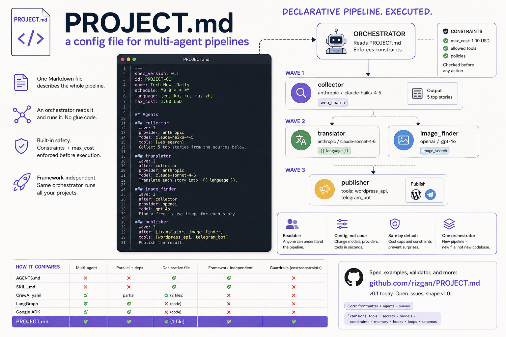

# PROJECT.md



**Language / Язык / 语言 / 言語 / 언어:**
[English](README.md) · [中文](README.zh.md) · [हिंदी](README.hi.md) · [Русский](README.ru.md) · [Português](README.pt.md) · [Español](README.es.md) · [日本語](README.ja.md) · [한국어](README.ko.md)

---

Un formato de archivo abierto para **pipelines multi-agente**.

Un único archivo Markdown describe el proyecto completo: qué agentes se ejecutan, en qué orden, con qué modelos, qué tienen permitido hacer y qué ocurre cuando fallan. Un orquestador lee el archivo y ejecuta el pipeline — sin necesidad de código de pegamento.

Si [AGENTS.md](https://agents.md) le dice a **un agente** cómo comportarse en un repositorio, PROJECT.md le dice a **un orquestador** cómo ejecutar un proyecto completo.

---

## Ejemplo mínimo

```markdown
---
spec_version: 0.5
id: PROJECT-01
name: Hello pipeline
---

## Agents

### writer
wave: 1
Write a one-paragraph summary of: {{ topic }}.

### reviewer
wave: 2
after: writer
Check the summary for factual errors. Return `approved` or `rejected`.
```

Esto es un PROJECT.md válido. Todo lo demás es opcional.

---

## Por qué

Hoy en día, definir un pipeline multi-agente significa escribir código de orquestación. Cada nuevo proyecto requiere nuevas clases, nuevas conexiones, nuevos archivos de configuración. La definición del pipeline son datos, no código — pertenece a un archivo.

PROJECT.md es ese archivo.

---

## Principios de diseño

1. **Markdown + YAML frontmatter.** Sin necesidad de aprender un nuevo lenguaje.
2. **El núcleo se mantiene pequeño.** Si una funcionalidad no es necesaria para el 80% de los pipelines, va a Extensiones, no al Núcleo.
3. **Declarativo, no imperativo.** El archivo describe *qué*; el orquestador decide *cómo*.
4. **Independiente del framework.** Cualquier orquestador puede implementarlo.

---

## Comparativa

| Capacidad                               | AGENTS.md | SKILL.md  | CrewAI yaml   | LangGraph     | Google ADK    | PROJECT.md    |
| --------------------------------------- | :-------: | :-------: | :-----------: | :-----------: | :-----------: | :-----------: |
| Formato                                 | Markdown  | Markdown  | 2× YAML       | Código Python | Código Python | Markdown+YAML |
| Perfil del autor                        | cualquiera| cualquiera| desarrollador | desarrollador | desarrollador | cualquiera    |
| Alcance                                 | 1 agente  | 1 habilid.| pipeline      | pipeline      | pipeline      | pipeline      |
| Archivo único                           | ✅        | ✅        | ❌ (2 archivos)| ❌ (código)  | ❌ (código)   | ✅            |
| Pipeline multi-agente                   | ❌        | ❌        | ✅            | ✅            | ✅            | ✅            |
| Ejecución secuencial                    | —         | —         | ✅            | ✅            | ✅            | ✅            |
| Ejecución paralela                      | —         | —         | ✅            | ✅            | ✅            | ✅ (`wave`)   |
| Dependencias de datos explícitas        | —         | —         | implícitas    | ✅ (aristas)  | implícitas    | ✅ (`after`)  |
| Bucles / reintento por juez             | —         | —         | parcial       | ✅            | ✅            | ✅ (ext)      |
| Agentes jerárquicos                     | —         | —         | ✅            | ✅            | ✅            | ✅ (ext)      |
| Modelo y proveedor por agente           | —         | —         | ✅            | ✅            | ✅            | ✅ (ext)      |
| Declaración de herramientas             | parcial   | parcial   | ✅            | ✅            | ✅            | ✅ (ext)      |
| I/O tipado (esquema)                    | —         | —         | parcial       | ✅            | ✅ (Pydantic) | ✅ (ext)      |
| Secretos como referencias               | —         | —         | nivel-código  | nivel-código  | nivel-código  | ✅ (ext)      |
| Memoria entre ejecuciones               | —         | —         | nivel-código  | ✅            | nivel-código  | ✅ (ext)      |
| Hooks de ciclo de vida                  | —         | —         | nivel-código  | nivel-código  | nivel-código  | ✅ (ext)      |
| Límites de costo / presupuesto          | —         | —         | ❌            | ❌            | ❌            | ✅ (ext)      |
| Restricciones de acción (permitir/denegar)| —       | —         | ❌            | ❌            | ❌            | ✅ (ext)      |
| Programación (cron)                     | —         | —         | ❌            | ❌            | ❌            | ✅ (ext)      |
| Modos de ejecución (dry/test/prod)      | —         | —         | ❌            | ❌            | ❌            | ✅ (ext)      |
| Independiente del framework             | ✅        | ✅        | ❌ (CrewAI)   | ❌ (LangGraph)| ❌ (ADK)      | ✅            |
| Diff legible por humanos en PR review   | ✅        | ✅        | ✅            | ❌            | ❌            | ✅            |

**Léalo así:** AGENTS.md y SKILL.md describen *una* unidad (un agente, una habilidad). CrewAI, LangGraph y ADK describen *pipelines* pero en código o esquema específico del framework. PROJECT.md es el único formato que es tanto **Markdown declarativo** como **independiente del framework** para la capa de pipeline.

PROJECT.md puede referenciar opcionalmente archivos AGENTS.md y SKILL.md existentes mediante extensiones, pero funciona perfectamente sin ellos.

> Los archivos específicos de IDE como `CLAUDE.md`, `GEMINI.md`, `.cursorrules`, `.github/copilot-instructions.md`, `.windsurfrules`, `.clinerules` se omiten intencionalmente — comparten el alcance de AGENTS.md (agente único, un repositorio) y solo difieren en qué herramienta los lee.

---

## Especificación

- [SPEC.md](SPEC.md) — especificación completa (Core + Extensions)
- [examples/PROJECT-minimal.md](examples/PROJECT-minimal.md) — pipeline solo con Core
- [examples/PROJECT-news.md](examples/PROJECT-news.md) — ejemplo completo del mundo real
- [validator/](validator/) — validador Python de referencia

---

## Estado

`v0.5` — borrador. Pueden haber cambios incompatibles hasta `v1.0`. Fije `spec_version` en sus archivos.

---

## Contribuciones

Se aceptan Issues y PRs — especialmente:
- Casos de uso reales que expongan carencias
- Implementaciones de orquestadores
- Retroalimentación sobre lo que *no* debería estar en la especificación

## Licencia

Apache-2.0 — ver [LICENSE](LICENSE).
